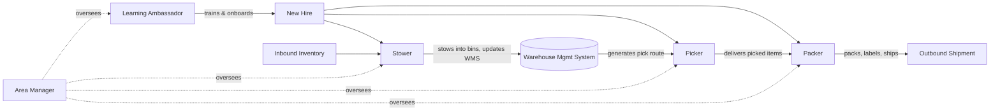

# Amazon Fulfillment Center — Workforce Structure Map

Built from the workforce role table (Learning Ambassador, Stower, Picker, Packer)
completed for Externship Project 1, Step 1.3.

## Diagram

## What the map shows

- **Reporting/oversight:** the Area Manager oversees all four roles (Learning
  Ambassador, Stower, Picker, Packer) — shown as dotted "oversees" lines.
- **Tightest coupling:** Stower → Picker → Packer form a strict sequential
  dependency chain that mirrors the physical flow of goods from inbound to
  outbound. An error at Stow (wrong bin) surfaces as a problem at Pick
  (item not found), which surfaces as a delay at Pack (missing item).
- **Off to the side:** the Learning Ambassador isn't part of that
  goods-flow chain at all. It's a feeder role — it supplies trained new
  hires *into* the other three roles rather than touching inventory itself.
